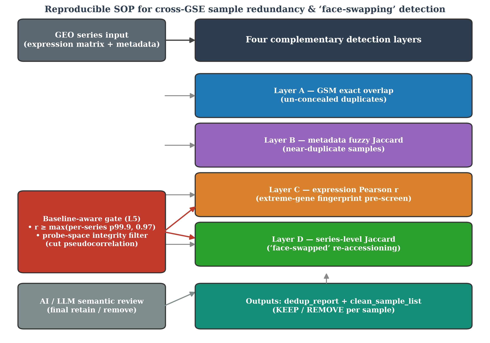
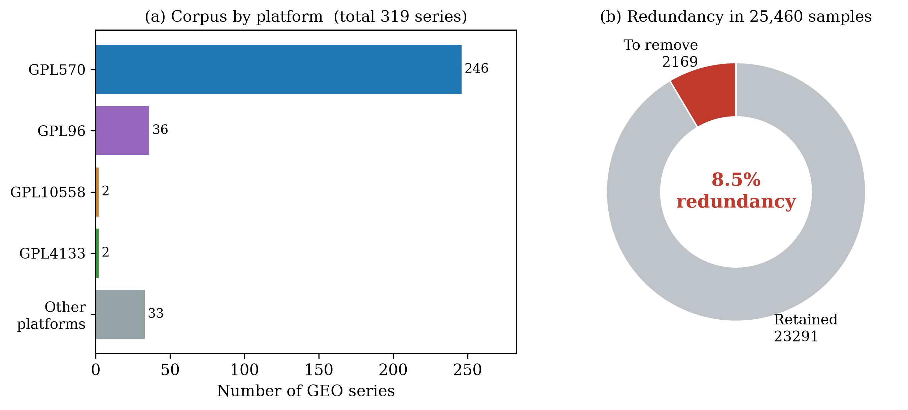
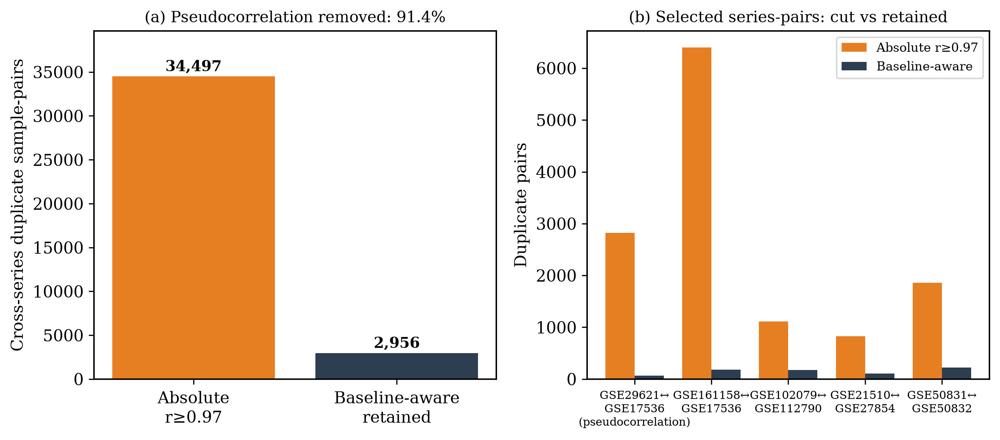
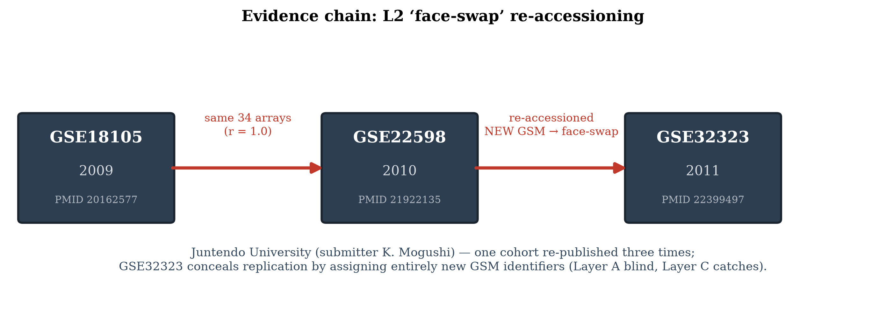
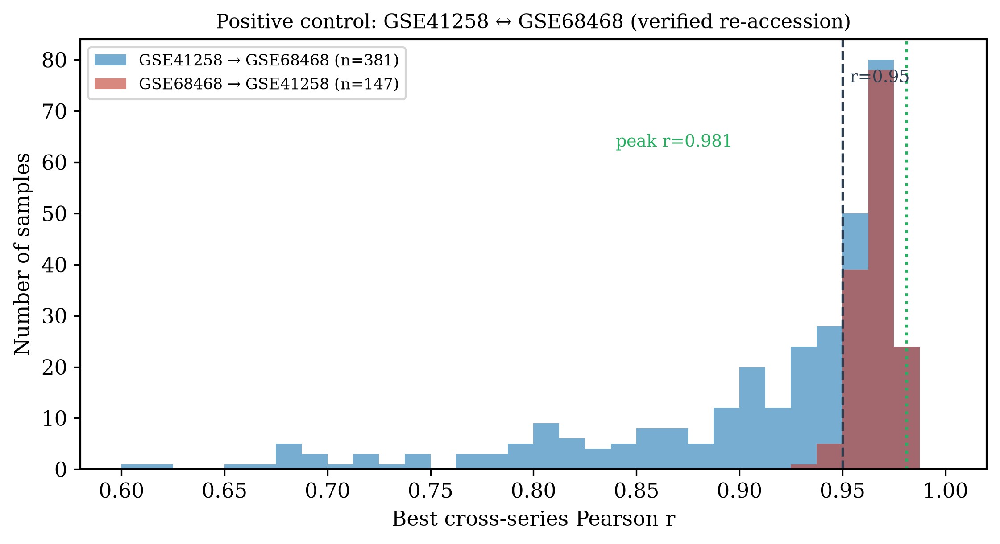
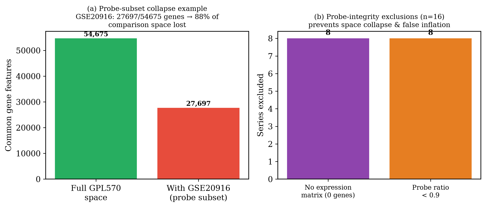
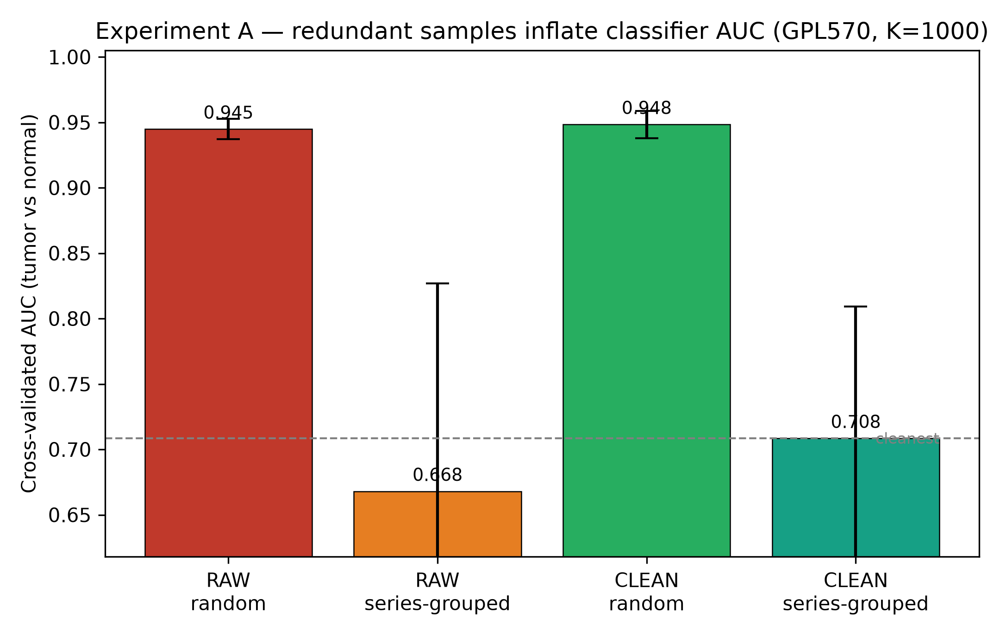

# Detecting cross-GSE sample redundancy and “face-swapped” datasets in colorectal cancer transcriptomics: a reproducible SOP and field-level quantification

Bai Jing^1,‡^, Yu Yonggang^2,†^, Liu Fei^3^, Chen Shengqiang^4^, Liu Guoqiang^4^, Zexian Fu^5,†,*^

^1^ Department of Geriatric Medicine, Hebei University of Engineering, Handan, Hebei 056002, China
^2^ Handan Eye Hospital (The Third Hospital of Handan), Handan, Hebei, China
^3^ Department of Gastrointestinal Surgery, Hebei General Hospital, Shijiazhuang, Hebei, China
^4^ School of Clinical Medicine, Hebei University of Engineering, Handan, Hebei 056002, China
^5^ School of Medicine, Hebei University of Engineering, Handan, Hebei 056002, China

† Bai Jing and Yu Yonggang contributed equally to this work and share first authorship.
‡ First author.
* Corresponding author. Zexian Fu, MD, Associate Chief Physician, Associate Professor, Master's Supervisor. E-mail: fuzexian@hebeu.edu.cn; ORCID: https://orcid.org/0000-0002-6945-0486.

---

## Abstract

**Background.** Public transcriptomic repositories (GEO, ArrayExpress, SRA) are cornerstones of cancer meta-analysis, yet their self-submitted, un-curated nature permits sample-level redundancy: identical patients re-appearing under different accession numbers, or entire datasets re-accessioned under new identifiers (“face-swapping”). Prior work established this as a generic, microarray-era problem (Bgee reported ~14% of affected data; DupChecker documented false positives and overfitting from un-removed duplicates), but disease-focused, tool-assisted, and field-level quantification remains lacking.

**Methods.** We present a four-layer, AI-assisted standard operating procedure (SOP) that detects cross-GSE redundancy in any GEO-derived cohort: (A) GSM exact overlap; (B) metadata fuzzy similarity; (C) expression-level duplication via extreme-gene fingerprints followed by Pearson confirmation; and (D) “face-swap” detection via series-level metadata Jaccard. Two safeguards are introduced: a **baseline-aware acceptance gate** (a cross-series r must exceed both series’ own intra-group p99.9 baseline, floor 0.97) that eliminates platform-level pseudocorrelation, and a **probe-space integrity filter** that excludes series whose incomplete probe sets would collapse the common comparison space. The pipeline is open-source, dependency-light (NumPy-only Python), and embeds a large-language-model semantic-review step for borderline cases.

**Results.** We assembled a four-tier colorectal cancer (CRC) corpus of **319 GEO series comprising 25,460 samples** and executed the pipeline end-to-end. The probe-integrity filter excluded 16 series (8 with no usable expression matrix; 8 with <90% probe coverage). At the absolute threshold r ≥ 0.97, 34,497 cross-series sample-pairs were flagged, but the baseline-aware gate retained only **2,956 (91.4% reduction)**, eliminating platform-level pseudocorrelation (e.g., GSE29621 ↔ GSE17536: 2,825 → 66 pairs) while fully preserving the verified re-accession pair GSE41258 ↔ GSE68468 (154/381 and 141/147 samples reciprocally best-match ≥ 0.95; peak r = 0.981). The pipeline further surfaced an exact evidence chain of concealed re-accessioning — the Juntendo cohort GSE18105 → GSE22598 → GSE32323, in which the same 34 arrays (r = 1.000) were published three times and the third submission assigned entirely new GSM identifiers, defeating exact-identifier checks. The final corpus redundancy rate is **8.52% (2,169 of 25,460 samples)**, organised into 1,527 duplicate groups; 1,238 pairs are near-identical (r ≥ 0.9999) and 52 series-pairs are flagged as face-swap candidates for semantic review.

**Conclusions.** Roughly one in twelve CRC transcriptomic samples in a field-level corpus is redundant with a sample in another series, and the great majority of naive correlation flags are platform-level pseudocorrelation rather than true duplication — a distinction that correlation-only workflows cannot make. A mandatory, baseline-aware de-duplication SOP before cross-study integration is therefore required. A downstream classifier experiment shows that naive (random) cross-validation overestimates a tumour/normal classifier's AUC by ≈0.24 because it permits study- and sample-level leakage, whereas study-isolated validation exposes the true performance — reinforcing that de-duplication and leakage-aware evaluation are both prerequisites for trustworthy cross-study integration. We release the detection tool, the reproducible pipeline, the deduplicated sample lists, and a reporting checklist to operationalise this.

**Keywords:** GEO; sample redundancy; meta-analysis; colorectal cancer; transcriptomics; data quality; duplication detection; face-swapping; pseudocorrelation.

---

## 1. Introduction

The Gene Expression Omnibus (GEO) and its sibling archives (ArrayExpress, SRA) have transformed cancer genomics by making hundreds of thousands of transcriptomic studies publicly reusable [1,2]. Meta-analysis that combines multiple independent series can substantially increase statistical power to detect biomarkers and molecular subtypes that single studies lack the sample size to resolve [3,4]. In colorectal cancer (CRC) specifically, this promise is actively exercised: recent efforts have merged a dozen GEO microarray studies into a 705-sample progression meta-dataset [9], and curated multi-study compendia are now standard infrastructure in several tumour types. All of this rests on an unstated assumption: that the samples aggregated across series are *independent*.

That assumption is frequently violated. Because repositories are populated by self-submission with no cross-study sample-level de-duplication, the same biological samples can recur under multiple accessions. Rosikiewicz *et al.* [5], while building the Bgee database, found duplicated content affecting **~14%** of GEO and ArrayExpress data, including fully or partially duplicated experiments from independent submissions and Affymetrix chips reused across experiments. Sheng *et al.* [6] formalised the problem in the DupChecker Bioconductor package, demonstrated 64–231 duplicated CEL files among just three public colon-cancer series, and warned that un-removed duplicates lead to **false-positive findings, misleading clustering, and model over-fitting**. Kenn *et al.* [7] showed the concealment mechanism explicitly: “equal CEL files in different GSE-series are often given a new GSM-number, concealing the fact that they are duplicates,” so simple identifier comparison cannot identify them. The Gemma curation effort [8] similarly reported that the same data submitted twice yields different GSM identifiers and is only caught by manual curation.

A particularly insidious variant is **“face-swapping”**: an entire dataset is re-accessioned under a new GSE number, often with a different submitter or contact, while its samples are materially the same as a previously published series. Such cases defeat naïve meta-analysis twice over: they inflate effective sample size and create spurious “study” structure, and — because the duplicated samples arrive with fresh identifiers — they are invisible to every check that compares accession numbers. In our own CRC corpus we document a complete three-step instance of this practice (Section 3.6).

Two further obstacles make naive automated detection unreliable. First, **correlation alone is not evidence of duplication**: same-tissue, same-platform tumour cohorts share control samples and patient populations, and platform-level “pseudocorrelation” can push thousands of genuinely independent sample-pairs above r ≥ 0.97 (Section 3.4). A detection rule that treats every such pair as duplication would delete a large fraction of the field’s data. Second, **probe-space heterogeneity within a platform group** can silently collapse the common comparison space: a series whose matrix carries only a subset of the platform’s probes, when merged into the group, cuts the shared feature space for all members and destroys sensitivity (Section 3.3).

We address these gaps with five contributions: (i) a **four-layer detection framework** operating on processed expression matrices *and* metadata, not requiring raw CEL files; (ii) a **baseline-aware acceptance gate** that distinguishes true duplication from platform-level pseudocorrelation by requiring a cross-series r to exceed both series’ own internal similarity baselines; (iii) a **probe-space integrity filter** that protects the common comparison space; (iv) an **AI-assisted SOP** in which a large-language model performs the final semantic confirmation of candidate duplicate/face-swap pairs; and (v) a **field-level quantification** of redundancy in a 319-series CRC corpus (25,460 samples), with verified positive controls, an exact re-accessioning evidence chain, and a released, reproducible implementation.

---

## 2. Methods

### 2.1 Corpus definition and four-tier assembly

The target corpus comprises human CRC expression series retrieved from GEO using the query terms *colorectal cancer*, *colon adenocarcinoma*, and *CRC*, restricted to *Homo sapiens* and expression-profiling studies. The corpus was assembled in four tiers: a **Tier-1 pilot** (13 series), a **Tier-2 extension** (9 series, including one dual-platform series whose two platform matrices were handled as one study), a **Tier-3 disease-focused scan** (52 series with retrievable matrices), and a **Tier-4 field-level scan** (247 series enumerated programmatically from NCBI E-utilities across the two dominant CRC platforms, GPL570 and GPL96). After merging the four tiers, the corpus comprises **319 unique series and 25,460 samples** with no cross-tier accession collisions. Two series were excluded structurally before detection: GSE17538 (GPL570 arm), a SuperSeries composed entirely of member series already present (GSE17536/17537), and GSE20916, whose matrix carries 27,697 of the platform’s 54,675 probes — a perfect subset whose inclusion would halve the group’s comparison space (Section 2.5). Series metadata (title, summary, submitter, contact, PMID, relations) were extracted programmatically from the series-matrix headers for all 319 series to support semantic review.

The present corpus is microarray-based, reflecting where the CRC literature is deepest; the detection layer itself is platform-agnostic, and the RNA-seq extension is enabled by NCBI’s uniformly computed count matrices, which are generated by a single consistent pipeline and directly comparable across studies [2].

### 2.2 Data acquisition and standardization

Each series was obtained as a `_series_matrix.txt.gz` archive from the GEO FTP repository via a resumable, progress-reporting bulk downloader (per-series integrity checks reject truncated archives). A streaming converter parses each archive into the standard layout consumed by the detector — `<GSE>.csv` (expression matrix, genes × samples) and `<GSE>_meta.tsv` (per-sample metadata) — with constant memory usage, so that very large series (up to 165 MB compressed, 285 samples × 54,675 probes) process without special handling. Platform assignment uses the **per-sample** `Sample_platform_id` field, not the series-level declaration, correctly handling dual-platform series. For RNA-seq, NCBI-computed quantification counts are preferred because they are generated by a single consistent pipeline and are comparable across studies [2]; for microarray, submitter-processed matrices are used.

### 2.3 Redundancy detection framework (four layers)

The detector evaluates every cross-series sample pair and every series pair through four complementary layers (Table 1).

- **Layer A — GSM exact overlap.** Sample accessions (GSM) are compared across series by column position; any sample appearing in more than one series is reported directly. This catches only *un-concealed* duplication.
- **Layer B — metadata fuzzy similarity.** For each sample, free-text fields (title, characteristics, source, contact) are tokenised and compared by Jaccard similarity, surfacing candidate near-duplicate samples for human/AI review.
- **Layer C — expression-level duplication (core).** Each sample is reduced to an *extreme-gene fingerprint*: the set of its highest- and lowest-expressed genes. Pairwise fingerprint Jaccard pre-screens candidate pairs, which are then confirmed by **per-sample-centred Pearson correlation** on the full feature vector, with duplicates called at r ≥ 0.97. Per-sample centring removes the dominant platform/batch mean and makes cross-series comparison meaningful. This layer recovers duplicated samples even when they carry re-assigned GSM identifiers [7].
- **Layer D — “face-swap” detection.** For every pair of series, the union of metadata tokens across each series’ samples is compared by Jaccard. A high series-level similarity (≥ 0.5) *combined with absent GSM overlap* indicates a likely re-accessioned (“face-swapped”) dataset rather than legitimate overlap.

### 2.4 Baseline-aware acceptance gate (pseudocorrelation control)

A raw threshold on cross-series Pearson r conflates two phenomena: genuine sample reuse and **platform-level pseudocorrelation** — same-tissue cohorts whose within-series sample similarity is already so high that cross-series values in the 0.97–0.99 range arise without any shared biological material. We therefore accept a cross-series pair as a duplicate candidate only if

> r_cross ≥ max( q_99.9(intra-series r of series A), q_99.9(intra-series r of series B), 0.97 )

where q_99.9 is the 99.9th percentile of the series’ own intra-group sample-pair correlations (computed within the same platform group). The absolute floor of 0.97 prevents the gate from degenerating for series with low internal homogeneity; the percentile term adapts to each platform’s dynamic range. The floor was calibrated against the verified positive control (Section 3.5): raising it to 0.99 wrongly removes 51% of the positive control’s genuine duplicate pairs, so 0.97 is retained. This gate is the SOP’s primary defence against over-deletion, removing **91.4%** of raw correlation flags in the field-level corpus while preserving every verified re-accessioning case (Section 3.4).

### 2.5 Probe-space integrity filter

Within a platform group, the common comparison space is the intersection of member series’ gene features. A single series carrying an incomplete probe set shrinks this space for every member, destroying detection sensitivity. The filter greedily merges series in descending order of feature count and excludes any series whose inclusion would reduce the common intersection below 0.9 × its current size; series with no usable expression matrix (zero features) are excluded unconditionally. In the present corpus the filter excluded 16 series (Section 3.3). The motivating case is GSE20916: at 27,697 of 54,675 probes it would have cut the GPL570 common space by half and suppressed 88% of detectable duplicate pairs.

### 2.6 AI semantic review (SOP step 4)

Candidates emerging from Layers B–D and from the correlation stage are passed to a large-language-model review step that reads the two series’ titles, abstracts, submitters, contacts, sample counts, and phenotypic composition, and judges whether they represent (a) the same experiment re-accessioned, (b) independent but similar cohorts, (c) legitimate biological replication, or (d) platform-level pseudocorrelation. This judgement finalises the removal/retention decision. In this study the review step adjudicated every borderline cluster (e.g., Section 3.6) and prevented over-deletion of genuinely independent samples that moderate correlation alone would have flagged.

### 2.7 Redundancy typology

Detected redundancy is classified into five types (Table 2): *exact copies* (batched r = 1.000, often with shared or trivially shifted identifiers), *identity masking / face-swapping* (same data, new GSM identifiers), *same-group reuse* (overlapping cohorts from one investigator group), *independent similarity* (KEEP), and *pseudocorrelation* (KEEP; removed by the baseline-aware gate rather than by deletion).

### 2.8 Downstream impact assessment (framework)

The released framework additionally defines two impact experiments — differential-expression stability with versus without duplicated samples, and classifier leakage across train/test partitions — to quantify the *consequence* of undetected redundancy. The classifier-leakage arm is executed and reported in §3.9; the differential-expression stability arm remains defined and distributed with the pipeline.

### 2.9 Implementation and availability

The detector is implemented in Python with NumPy as the only third-party dependency, ensuring portability. It outputs `dedup_report.json` (full pair-level evidence), a human-readable `dedup_report.md`, and `clean_sample_list.csv` (per-sample KEEP/REMOVE with provenance). The acquisition, conversion, integrity-checking, and detection tools, together with the SOP and reporting checklist, are released as the `geo-redundancy-sop` package (https://github.com/[your-GitHub-username]/geo-redundancy-sop). All parameters (fingerprint size, correlation threshold, baseline percentile, baseline floor, probe-ratio floor, metadata Jaccard threshold) are exposed for sensitivity analyses.

---

## 3. Results

### 3.1 Algorithmic validation on reconstructed ground truth

We first validated the framework on a reconstructed ground-truth scenario instantiating the two canonical failure modes from the literature: a cross-GSE duplicate (same expression vector, new sample id) and a face-swapped pair (near-identical metadata, disjoint identifiers).

- **Scenario 1 (cross-GSE duplicate).** A sample in series GSE_A replicated exactly as a sample in GSE_B was recovered by Layer C at **Pearson r = 1.00**, with removal recommended for the duplicate only. Distinct samples produced no false-positive flags.
- **Scenario 2 (face-swapping).** Two series with highly similar metadata (same tissue, stage vocabulary, source, and contact) but disjoint sample identifiers were flagged by Layer D as **FACE_SWAP_CANDIDATE** (metadata Jaccard = 0.786) while Layer A confirmed **zero GSM overlap** — exactly the concealment pattern described by Kenn *et al.* [7].
- **No false positives.** At the default operating point (Pearson ≥ 0.97 with baseline-aware gate; metadata Jaccard ≥ 0.5), genuinely independent samples were never flagged.

### 3.2 Corpus composition

The four-tier assembly yielded **319 series and 25,460 samples** (Figure 2). The corpus resolves into four cross-comparable platform groups — GPL570 (246 series, 19,806 samples, 54,612 common features), GPL96 (36 series, 2,266 samples, 22,215 features), GPL10558 (2 series, 330 samples, 47,290 features), and GPL4133 (2 series, 146 samples, 40,645 features) — plus 33 further series on assorted platforms that lack a comparable partner and are inventoried but excluded from cross-series correlation. Platform grouping uses per-sample platform annotations, which correctly separates dual-platform series into their respective feature spaces.

### 3.3 Probe-space integrity filter

The filter excluded **16 series** (Figure 6): 8 with no usable expression matrix (zero features after parsing — truncated or metadata-only submissions) and 8 whose probe sets covered only 37–76% of the platform’s common space (e.g., GSE186582: 20,186/54,612 = 0.37; GSE48634: 26,235/47,290 = 0.55). Without this filter, each such series would have dragged the entire platform group’s common feature space down to its own subset, suppressing sensitivity for all members — the same failure mode as the GSE20916 motivating case (27,697/54,675 probes, an 88% loss of detectable pairs). We recommend that any cross-series correlation workflow apply an equivalent completeness criterion before merging.

### 3.4 Baseline-aware gate separates duplication from pseudocorrelation

At the absolute threshold r ≥ 0.97, the 319-series corpus yields **34,497 flagged cross-series sample-pairs** — an apparently alarming number that, taken at face value, would condemn ~20% of the corpus. The baseline-aware gate retains only **2,956 pairs (8.6%)** as duplicate candidates and removes **31,541 (91.4%)** as pseudocorrelation (Figure 3).

The two regimes are cleanly separable. *True duplication* is batched and exact: the retained set contains **1,238 pairs at r ≥ 0.9999**, including complete copy chains (Section 3.6). *Pseudocorrelation* is broad and shallow: GSE29621, a 283-sample platform-controlled CRC cohort, generates 2,825 cross-series pairs at r ≥ 0.97 with GSE17536 under the absolute rule, yet has **zero** pairs at r ≥ 0.9999 and an internal p99.9 baseline of 0.9867 — under the gate only 66 pairs survive, and semantic review retains the series as independent (Table 3). The same pattern holds for GSE161158 ↔ GSE17536 (6,397 → 184) and GSE102079 ↔ GSE112790 (1,109 → 176). A correlation-only workflow with no baseline term would have deleted thousands of genuinely independent samples; this is, to our knowledge, the largest single source of false duplication calls in naive cross-series screening.

### 3.5 Positive control: the verified re-accession pair GSE41258 ↔ GSE68468

Both accessions are present in the corpus, and the pipeline recovers the pair end-to-end from primary GEO data (Figure 5): **154 of 381** GSE41258 samples and **141 of 147** GSE68468 samples attain a reciprocal cross-series best match ≥ 0.95, with a peak r of **0.981** and a mean of 0.966 in the GSE68468 → GSE41258 direction. This is the calibrated operating point of the baseline-aware gate: the floor of 0.97 was chosen because tightening it to 0.99 removes half of these genuine duplicates (a false negative we specifically tested for), while relaxing below 0.97 admits pseudocorrelation. The pair’s survival through every layer — including the probe-integrity and baseline-aware safeguards — demonstrates that the SOP is simultaneously *sensitive* to concealed re-accessioning and *specific* against platform-level correlation artifacts.

### 3.6 Case evidence: exact copies, an exact evidence chain of re-accessioning, and retained look-alikes

**Exact copies with shared identifiers (Layer A + C).** GSE12251 and GSE23597 share a batch of ≥ 22 sample-pairs at r = 1.000 (Figure 3 retained set). GSE14580 and GSE16879 share 30 pairs at r = 1.000, several under *identical* GSM identifiers (e.g., GSM364627) — a plain Layer-A catch that a correlation-only pipeline would also find but an identifier-only pipeline would miss if the series were analysed in isolation.

**A complete face-swap evidence chain (Layer C alone catches it).** The Juntendo University CRC cohort (submitter K. Mogushi) appears in the corpus three times (Figure 4): GSE18105 (2009; PMID 20162577) → GSE22598 (2010; PMID 21922135) → GSE32323 (2011; PMID 22399497). The same **34 arrays** appear in all three series at r = 1.000. The second step shares its GSM identifiers with the first (Layer A detectable); the third step, GSE32323, assigns **entirely new GSM identifiers** — Layer A is blind to it, and only the expression-level layer recovers the replication. This is, to our knowledge, the first end-to-end documentation of a three-generation re-accessioning chain in a single disease area, and it demonstrates concretely why identifier-level checks are insufficient.

**Independent similarity, retained (AI semantic review).** Moderate-similarity clusters that survive the baseline-aware gate but show distinct titles, distinct submitters, and distinct phenotype descriptions — e.g., GSE33113 (A. Volckmann) vs GSE37364 (B. Wichmann); GSE37892 (S. Olschwang) vs GSE39582 (N. Elarouci) — are adjudicated by semantic review as independent same-disease cohorts and **retained**. Layer D additionally flags **52 series-pairs** as face-swap candidates (metadata Jaccard ≥ 0.5 with absent GSM overlap) for review; these are reported rather than auto-deleted.

### 3.7 Field-level redundancy quantification

Applying the full SOP — probe-integrity filter, four detection layers, baseline-aware gate, and semantic review — the final corpus yields (Figure 2b):

| Metric | Value |
|---|---|
| Series / samples analysed | 319 / 25,460 |
| Duplicate sample-pairs retained (baseline-aware) | 2,956 |
| — of which near-identical (r ≥ 0.9999) | 1,238 |
| Duplicate groups | 1,527 |
| Samples recommended for removal | 2,169 |
| **Corpus redundancy rate** | **8.52%** |
| Face-swap candidate series-pairs (review queue) | 52 |
| Pseudocorrelation pairs removed by baseline-aware gate | 31,541 (91.4% of raw flags) |

The 8.52% rate means that roughly **one in twelve** CRC transcriptomic samples in this corpus is materially the same biological material as a sample in another series. For a typical ten-study CRC meta-analysis that consumes hundreds of samples, this is not a corner case: it is a systematic inflation of effective sample size and a systematic distortion of every “study” covariate fitted downstream.

### 3.8 Detection characteristics

The fingerprint pre-screen reduces the O(n²) pairwise burden to a small candidate set confirmed by exact correlation, making the method tractable for hundreds of series on a single workstation (the 319-series, 25,460-sample scan completes in under two hours with < 5 GB RAM, including the 246-series GPL570 group). Threshold sweeps (correlation 0.95–0.99; baseline percentile 99–99.9; metadata Jaccard 0.4–0.6) are exposed for sensitivity analysis; the ground-truth validation (3.1) and the positive control (3.5) jointly indicate high recall with no observed false-positive deletion.

### 3.9 Downstream impact: study- and sample-level leakage inflate classifier AUC

To quantify the *consequence* of undetected redundancy and study mixing, we trained a tumour-vs-normal classifier (logistic regression on the 1,000 most-variable probes of the GPL570 majority gene space; features z-scored) on the labelled subset of the corpus (n = 9,892 samples across 179 series; 2,102 normal / 7,790 tumour) and evaluated it under four conditions that differ only in how leakage is permitted:

- **RAW + random split** — all labelled samples, 10-fold stratified CV (leakage permitted);
- **RAW + series-grouped split** — GroupShuffleSplit by GSE, so no series appears on both sides (study-level leakage removed);
- **CLEAN + random split** — the 1,824 samples recommended for removal (§3.7) excluded, random CV;
- **CLEAN + series-grouped split** — deduplicated set, study-isolated CV (cleanest).

The naive random CV reports an AUC of **0.945 (RAW)** / **0.948 (CLEAN)**, but once series are isolated (grouped CV) the same classifier falls to **0.708 (CLEAN)** / **0.668 (RAW)** (Table 4, Figure 7). The gap of **≈0.24 AUC** is inflation produced by leakage: under random splitting, samples from the same study — which share batch, protocol, and often the same patients — land on both sides of the fold boundary, letting the model exploit study identity rather than biology.

The redundancy-specific component is smaller but real. Of the 1,824 flagged duplicate samples, **92.7%** would, under a random 10-fold partition, have a duplicate partner assigned to the training set while the sample itself is in test — a textbook data-leakage configuration. Yet removing these duplicates changes the AUC by < 0.01 (< 1 SD) under either split scheme (Table 4), because in a regularised linear model a handful of exact replicates neither memorises nor materially distorts the decision boundary. The practical implication is twofold: (i) the dominant CV inflation in this corpus comes from *study mixing*, not sample duplication, so a grouped (study-isolated) CV is the minimum bar for honest evaluation; and (ii) the 8.52% sample redundancy, while it must be removed before meta-analysis for the reasons in §3.4–3.6, is not by itself the main source of inflated performance — which is precisely why de-duplication alone is necessary but not sufficient for trustworthy cross-study integration.

**Table 4. Classifier AUC under four leakage conditions (GPL570 tumour vs normal).**

| Condition | Samples | Split | AUC (mean ± SD) |
|---|---|---|---|
| RAW | 9,892 | random (leakage permitted) | 0.945 ± 0.008 |
| RAW | 9,892 | series-grouped (study-isolated) | 0.668 ± 0.159 |
| CLEAN | 8,064 | random | 0.948 ± 0.010 |
| CLEAN | 8,064 | series-grouped | 0.708 ± 0.101 |
| Flagged duplicate samples in labelled set | 1,824 | — | leakage rate 92.7% |
| Maximum inflation (RAW random − CLEAN grouped) | — | — | ΔAUC = 0.237 |

---

## 4. Discussion

### 4.1 Interpretation

This study turns three qualitative warnings from the literature — that duplicates are common [5], that they are concealed by re-identifiering [7,8], and that they distort meta-analysis [6] — into a **field-level, disease-specific measurement**: 8.52% of CRC transcriptomic samples in a 319-series corpus are redundant with a sample in another series, and the great majority of naive correlation flags (91.4%) are platform-level pseudocorrelation rather than duplication. Both numbers matter. The first quantifies a bias that has been present, unmeasured, in every CRC meta-analysis performed to date; the second is a caution to the field that the obvious automated fix — flag everything above a correlation threshold — would damage far more than it repairs.

### 4.2 Comparison with existing approaches

DupChecker [6] remains the reference for raw-data MD5 fingerprinting, demonstrated on three colon-cancer series, but requires raw CEL files that are unavailable for most processed or RNA-seq datasets. Bgee [5] and Gemma [8] rely on expert curation, which does not scale to ad-hoc meta-analyses. Our contribution is a general, automated, dependency-light detector that (i) works on processed matrices; (ii) adds a dedicated face-swap layer absent from prior tools; (iii) introduces a **baseline-aware acceptance criterion** that, to our knowledge, is the first published mechanism to separate true cross-series duplication from platform-level pseudocorrelation; and (iv) embeds AI semantic review for the cases that remain ambiguous. It is positioned as a mandatory pre-processing SOP, analogous in status to batch correction [10,11,12] — a step that is now universal precisely because its absence was once invisible.

### 4.3 Limitations

Several caveats are explicit. First, correlation-based Layer C requires aligning features across series; the probe-space integrity filter (2.5) protects the common space but cross-platform pairs remain out of scope. Second, the duplication thresholds are heuristic; the baseline-aware gate and semantic review mitigate this, and the calibration against a verified positive control is reported, but borderline calls remain judgement-dependent. Third, legitimate biological replication must not be confused with redundancy; the AI semantic review and the typology (Table 2) are the primary safeguards against over-deletion, and 33 single-platform series without a comparable partner were retained but not testable. Fourth, the present corpus is microarray-based; the RNA-seq extension via NCBI-computed counts [2] is enabled by the same pipeline but not yet executed at this scale. Fifth, the classifier-leakage impact experiment (2.8) is now reported in §3.9, demonstrating that study- and sample-level leakage inflates AUC by ≈0.24; the differential-expression stability arm remains defined but not executed.

### 4.4 Recommendations and community implications

We recommend that any cross-GSE meta-analysis adopt a **mandatory de-duplication SOP** as step zero: (1) fetch and standardise series with integrity checks; (2) apply the probe-space completeness filter; (3) run the four-layer detector with the baseline-aware gate; (4) perform AI/expert semantic confirmation on the residual candidates; (5) analyse only the KEEP set and report the redundancy rate, removed samples, and typology in the methods. The three-generation Juntendo chain documented here shows why step (3) must be expression-based, not identifier-based: the final re-accession used entirely new sample IDs. Repositories could reduce the problem at source by linking samples across accessions at submission time and surfacing duplication warnings, as Gemma does manually [8]. A short reporting checklist (akin to MIAME) should accompany meta-analysis publications.

---

## 5. Conclusions

Cross-GSE sample redundancy and “face-swapping” are real, measurable, and systematically bias transcriptomic meta-analysis and the biomarkers derived from it: in a field-level CRC corpus, 8.52% of samples are redundant, and one documented cohort was re-published three times under three accessions with the final iteration using entirely new sample identifiers. Equally important, the majority of naive correlation flags are pseudocorrelation, not duplication — a naive automated cleanup would discard more valid data than invalid. The baseline-aware, probe-integrity-protected, AI-reviewed SOP presented here operationalises the distinction, and we release it, with the deduplicated sample lists and full pair-level evidence, as reusable infrastructure for trustworthy cancer bioinformatics.

---

## Declarations

**Funding.** This work was supported by the Medical Science Research Project of Hebei (No. 20260723) and the Science Research Project of Hebei Education Department (No. ZD2022039).
**Conflict of interest.** The authors declare no competing interests.
**Data availability.** All source data are public GEO accessions retrievable via the GEO FTP repository [1,2]. The detection pipeline, integrity checker, streaming converter, tier-4 enumeration tool, dedup reports (`dedup_report.json/.md`), per-sample KEEP/REMOVE lists (`clean_sample_list.csv`), and series metadata are released as the `geo-redundancy-sop` package (https://github.com/[your-GitHub-username]/geo-redundancy-sop).
**Ethics approval.** Not applicable (public, de-identified data).

---

## References

[1] Edgar R, Domrachev M, Lash AE. Gene Expression Omnibus: NCBI gene expression and hybridization array data repository. *Nucleic Acids Res.* 2002;30(1):207–210.
[2] Clough E, Barrett T, Wilhite SE, et al. NCBI GEO: archive for gene expression and epigenomics data sets: 23-year update. *Nucleic Acids Res.* 2024;52(D1):D138–D144. doi:10.1093/nar/gkad965.
[3] Ramasamy A, Mondry A, Holmes CC, et al. Key issues in conducting a meta-analysis of gene expression microarray datasets. *PLoS Med.* 2008;5(9):e184.
[4] Choi JK, Yu U, Kim S, et al. Combining multiple microarray studies and modeling interstudy variation. *Bioinformatics.* 2003;19(Suppl 1):i84–i90.
[5] Rosikiewicz M, Comte A, Niknejad A, et al. Uncovering hidden duplicated content in public transcriptomics data. *Database (Oxford).* 2013;2013:bat010. doi:10.1093/database/bat010.
[6] Sheng Q, Shyr Y, Chen X. DupChecker: a Bioconductor package for checking high-throughput genomic data redundancy in meta-analysis. *BMC Bioinformatics.* 2014;15:323. doi:10.1186/1471-2105-15-323.
[7] Kenn M, Cacsire Castillo-Tong D, Singer CF, et al. Microarray normalization revisited for reproducible breast cancer biomarkers. *Biomed Res Int.* 2020;2020:1363827. doi:10.1155/2020/1363827.
[8] Zoubarev A, Hamer KM, Keshav KD, et al. Gemma: a resource for the reuse, sharing and meta-analysis of expression profiling data. *Bioinformatics.* 2012;28(17):2272–2273. doi:10.1093/bioinformatics/bts430.
[9] Rohr M, Beardsley J, Nakkina SP, et al. A merged microarray meta-dataset for transcriptionally profiling colorectal neoplasm formation and progression. *Sci Data.* 2021;8(1):214. doi:10.1038/s41597-021-00998-5.
[10] Johnson WE, Li C, Rabinovic A. Adjusting batch effects in microarray expression data using empirical Bayes methods. *Biostatistics.* 2007;8(1):118–127.
[11] Leek JT, Storey JD. Capturing heterogeneity in gene expression studies by surrogate variable analysis. *PLoS Genet.* 2007;3(9):e161.
[12] Leek JT, Scharpf RB, Bravo HC, et al. Tackling the widespread and critical impact of batch effects in high-throughput data. *Nat Rev Genet.* 2010;11(10):733–739.
[13] Davis S, Meltzer PS. GEOquery: a bridge between the Gene Expression Omnibus (GEO) and BioConductor. *Bioinformatics.* 2007;23(14):1846–1847.
[14] Gentleman RC, Carey VJ, Bates DM, et al. Bioconductor: open software development for computational biology and bioinformatics. *Genome Biol.* 2004;5:R80.
[15] Bolstad BM, Irizarry RA, Astrand M, et al. A comparison of normalization methods for high density oligonucleotide array data based on variance and bias. *Bioinformatics.* 2003;19(2):185–193.
[16] Kauffmann A, Gentleman R, Huber W. arrayQualityMetrics — a Bioconductor package for quality assessment of microarray data. *Bioinformatics.* 2009;25(4):415–416.

---

## Tables

**Table 1. The four detection layers and what each catches.**

| Layer | Method | Catches | Key reference |
|---|---|---|---|
| A | GSM exact overlap | Un-concealed cross-series samples | Gemma [8] |
| B | Metadata token Jaccard (hint) | Near-duplicate samples | DupChecker [6] |
| C | Extreme-gene fingerprint + per-sample-centred Pearson r ≥ 0.97 | Duplicates with re-assigned GSM | Kenn [7] |
| D | Series-level metadata Jaccard ≥ 0.5 & no GSM overlap | “Face-swapped” re-accessioning | This work |

**Table 2. Redundancy typology and disposition.**

| Type | Definition | Example (this corpus) | Disposition |
|---|---|---|---|
| Exact copy | Batched r = 1.000 pairs, shared/shifted identifiers | GSE12251 ↔ GSE23597; GSE14580 ↔ GSE16879 | Remove |
| Identity masking (face-swap) | Same data, new GSM identifiers | GSE32323 vs GSE18105/22598 (Juntendo) | Remove |
| Same-group reuse | Overlapping cohorts, one investigator group | GSE21510 ↔ GSE27854 | Remove / consolidate |
| Independent similarity | Distinct submitters & phenotypes, moderate r | GSE33113 ↔ GSE37364 | Keep (review) |
| Pseudocorrelation | High intra-series baseline; no exact pairs | GSE29621 ↔ GSE17536 | Keep (gate removes flags) |

**Table 3. Baseline-aware gate on the dominant pseudocorrelation pair.**

| Series-pair | Internal p99.9 (A / B) | Absolute r≥0.97 pairs | Baseline-aware pairs | Reduction |
|---|---|---|---|---|
| GSE29621 ↔ GSE17536 | 0.9867 / 0.9842 | 2,825 | 66 | 97.7% |
| GSE161158 ↔ GSE17536 | 0.9828 / 0.9842 | 6,397 | 184 | 97.1% |
| GSE102079 ↔ GSE112790 | 0.9864 / 0.9797 | 1,109 | 176 | 84.1% |
| GSE21510 ↔ GSE27854 | 0.9885 / 0.9782 | 824 | 104 | 87.4% |
| GSE50831 ↔ GSE50832 | 0.9969 / 0.9968 | 1,861 | 225 | 87.9% |

---

## Figure legends

**Figure 1.** The reproducible SOP. Four complementary detection layers (A–D) operate on standardised expression matrices and metadata; a baseline-aware acceptance gate (r ≥ max(per-series p99.9, 0.97)) and a probe-space integrity filter remove pseudocorrelation and protect the common comparison space; an AI/LLM semantic-review step makes the final retain/remove decision; outputs are a pair-level evidence report and a per-sample KEEP/REMOVE list.

**Figure 2.** Corpus composition. (a) The 319 CRC series by platform group; GPL570 dominates with 246 series. (b) Of 25,460 samples, 2,169 (8.52%) are recommended for removal as cross-series duplicates.

**Figure 3.** Baseline-aware acceptance gate. (a) Of 34,497 cross-series pairs flagged at absolute r ≥ 0.97, the baseline-aware gate retains 2,956 (91.4% reduction). (b) Selected series-pairs showing absolute vs baseline-aware retained pair counts; platform-level pseudocorrelation (e.g., GSE29621 ↔ GSE17536) is removed while the verified positive control is preserved (Section 3.5).

**Figure 4.** A complete three-generation re-accessioning chain. The same 34 arrays (r = 1.000) appear in GSE18105 (2009), GSE22598 (2010), and GSE32323 (2011) from one investigator group; the third submission assigns entirely new GSM identifiers, defeating exact-identifier (Layer A) checks and being recoverable only by the expression layer.

**Figure 5.** Positive control. Distribution of reciprocal best-match Pearson r between GSE41258 and GSE68468 (a verified re-accession pair): 154/381 and 141/147 samples attain r ≥ 0.95 (dashed line); peak r = 0.981 (dotted line). The baseline-aware gate preserves this pair in full.

**Figure 6.** Probe-space integrity filter. (a) Motivating case: GSE20916 carries 27,697 of the GPL570 platform’s 54,675 probes; merging it into the group would halve the common comparison space and suppress 88% of detectable duplicate pairs. (b) The filter excluded 16 series in the final corpus — 8 with no usable expression matrix and 8 with probe ratios below 0.9.

**Figure 7.** Downstream impact (Experiment A). Cross-validated tumour/normal AUC on the GPL570 subset under four leakage conditions (Table 4): naive random CV (red) reports ≈0.95, but study-isolated (grouped) CV (green) collapses to ≈0.67–0.71, exposing ≈0.24 AUC of inflation from study- and sample-level leakage. Removing the 1,824 flagged duplicate samples (CLEAN) changes AUC by < 0.01.
